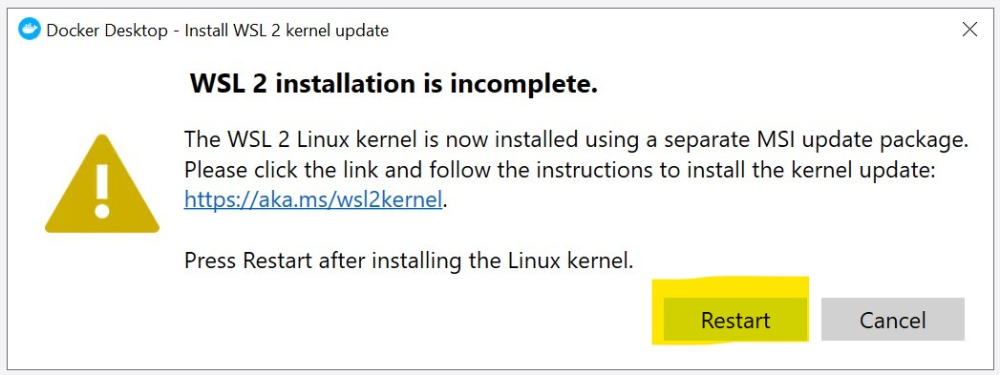

# NoSQL in Action!

https://github.com/w4bo/2023-asw-nosql

NoSQL (Not Only SQL) exercises.

## Install

- Install `docker`
    - Windows: https://docs.docker.com/desktop/windows/install/
    - Mac: https://docs.docker.com/desktop/mac/install/
    - Linux: https://docs.docker.com/engine/install/ubuntu/
- Install `docker-compose`
    - Windows and Mac: Docker Compose is already included in Docker Desktop
    - Linux: https://docs.docker.com/compose/install/
- Run docker (sometimes docker has to be (re)started over and over again)
    - Windows
        - Double click on Docker Desktop from the Windows Desktop
        - This warning will pop up, DO NOT close it, but click on the link!
        
        - Download the WSL kernel from here
        
        - Click on restart
        
- Check that docker works by opening a *new* terminal (`cmd.exe` in Windows or `/bin/bash` in Linux) and running `docker run hello-world`
- Install NodeJS (tested with versions 16.13.2 and 17.3.0)
    - https://nodejs.org/en/download/
    - Check that NodeJS works by opening a *new* terminal (`cmd.exe` in Windows or `/bin/bash` in Linux) and running `node --version` (e.g., the output should be `v17.3.1`)
- Install Robo 3T (not Studio 3T): https://robomongo.org/download

## Running the software

### Windows

Two alternatives:
- Unzip and enter the downloaded folder, double click on `openprompt.bat`
- Open a new terminal and run the following commands:

        cd C:\path\to\the\downloaded\folder (replace it with the actual path)
        cd code
        start.bat

- If Windows complains about:
  - Running the scripts

    
    
    and then

    

  - Sharing directories

    

- If everything runs well, the result should be something like:

    

### Linux and MacOS

Open a new terminal and run the following commands:

    cd /path/to/the/downloaded/folder (replace it with the actual path)
    cd code
    sh start.sh
